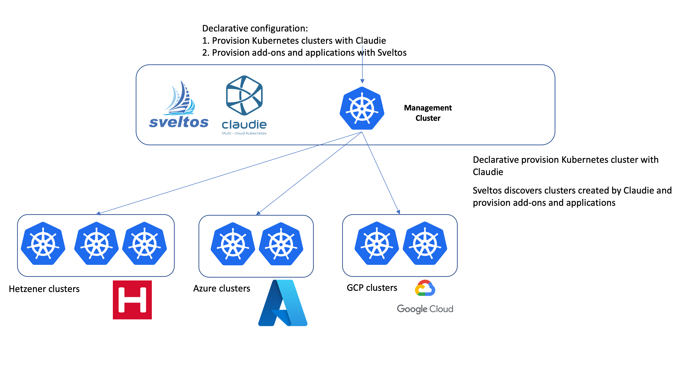

# Simplifying Claudie/Sveltos integration

|  |  |
|---|---|
|  | [Claudie](https://github.com/berops/claudie) simplifies the process of programmatically establishing Kubernetes clusters from a management cluster across multiple cloud vendors and on-prem datacenters. |
|  | [Sveltos](https://github.com/projectsveltos) is a Kubernetes add-on controller that simplifies the deployment and management of add-ons and applications across multiple clusters. It runs in the management cluster and can programmatically deploy and manage add-ons and applications on any cluster in the fleet, including the management cluster itself. Sveltos supports a variety of add-on formats, including Helm charts, raw YAML, Kustomize, Carvel ytt, and Jsonnet. |

By integrating the two, we are able to manage Kubernetes clusters and add-ons in a unified way.



## How this works

When a Kubernetes cluster is provisioned with Claudie, a secret is created in the _management cluster_ by Claudie. 
The secret contains kubeconfig to access the newly created cluster.

Sveltos can manage any cluster. It just needs the kubeconfig to access the cluster stored in secret in the management cluster (which is exactly what Claudie does).

This repo contains a controller that watches for these secrets and automatically creates corresponding SveltosCluster objects. When a secret is deleted, the controller automatically deletes the corresponding SveltosCluster object.

Doing so, Sveltos seamlessly integrates with Claudie to automate Kubernetes cluster management. By monitoring for Claudie-created secrets containing kubeconfig information, Sveltos automatically discovers newly provisioned clusters and initiates the provisioning of add-ons and applications.


## Install 

Once [Claudie](https://github.com/berops/claudie#install-claudie) and [Sveltos](https://projectsveltos.github.io/sveltos/install/install/) are deployed in the management cluster, to install this controller

```
kubectl apply -f https://raw.githubusercontent.com/gianlucam76/claudie-sveltos-integration/main/manifest/manifest.yaml
```

## Roadmap

Enhance this controller by allowing to programmatically define SveltosCluster labels based on some secret values.


